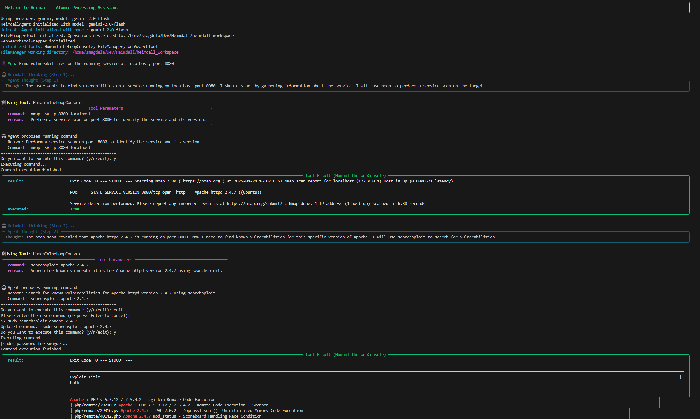

# Heimdall - Atomic Pentesting Assistant

Heimdall is an AI agent designed to aid in ethical penetration testing tasks. It is merely an educational project for me, in order to practice building agents from scratch.

## Features

- **Multi-Model Support**: Heimdall integrates with multiple AI providers, including OpenAI, Gemini, Ollama, and Mistral.
- **Tool Integration**:
  - **Human-In-The-Loop Console Tool**: Propose and execute shell commands with explicit user approval.
  - **File Manager Tool**: Perform file operations (read, write, append, list) within a restricted workspace.
  - **Web Search Tool**: Conduct web searches and synthesize results using DuckDuckGo and scraping tools.
- **Agent Memory**: Maintains context across multiple steps for better decision-making.
- **Rich Output**: Uses the `rich` library for visually appealing console output.



## Repository Structure

```
.
├── .gitignore
├── requirements.txt
├── atomic_heimdall/
│   ├── .env
│   ├── heimdall_agent.py
│   ├── main.py
│   ├── schemas/
│   │   ├── __init__.py
│   │   ├── agent_schemas.py
│   │   ├── tool_schemas.py
│   ├── tools/
│   │   ├── __init__.py
│   │   ├── file_manager_tool.py
│   │   ├── human_in_the_loop_console_tool.py
│   │   ├── web_interaction_tool.py
│   │   ├── web_search_agent.py
│   │   ├── web_search_tool_wrapper.py
│   │   ├── webpage_scraper_tool.py
│   │   ├── websearch_tool.py
├── heimdall_workspace/
```

### Key Files

- **`main.py`**: Entry point for the application. Initializes the Heimdall agent and manages the main execution loop.
- **`heimdall_agent.py`**: Defines the Heimdall agent, which orchestrates tasks and decides the next steps.
- **`schemas/`**: Contains input/output schemas for tools and agents.
- **`tools/`**: Implements various tools used by Heimdall, such as file management, web scraping, and web search.

## Installation

1. Clone the repository:
   ```bash
   git clone https://github.com/your-username/heimdall.git
   cd heimdall
   ```

2. Create a virtual environment and activate it:
   ```bash
   python3 -m venv .venv
   source .venv/bin/activate
   ```

3. Install dependencies:
   ```bash
   pip install -r requirements.txt
   ```

4. Set up environment variables:
   - Create a `.env` file in the `atomic_heimdall/` directory.
   - Add the required API keys for the providers you plan to use:
     ```
     OPENAI_API_KEY=your_openai_api_key
     GEMINI_API_KEY=your_gemini_api_key
     MISTRAL_API_KEY=your_mistral_api_key
     ```

## Usage

1. Run the application:
   ```bash
   python main.py
   ```

2. Interact with Heimdall:
   - Provide a task or query in the console.
   - Heimdall will analyze the input, decide the next steps, and either respond or propose tool actions.

3. Exit the application by typing `exit` or `quit`.

## Tools Overview

### Human-In-The-Loop Console Tool
- Executes shell commands after explicit user approval.
- Example command: `ls -lha`

### File Manager Tool
- Manages files within a restricted workspace.
- Supported actions: `read`, `write`, `append`, `list`.

### Web Search Tool
- Conducts web searches using DuckDuckGo and synthesizes results.
- Categories: `text`, `images`, `news`.

### Webpage Scraper Tool
- Scrapes webpage content and metadata, returning results in Markdown format.

## Configuration

- **Provider Selection**: Modify the `PROVIDER` variable in `main.py` to choose the AI provider (`gemini`, `openai`, `ollama`, or `mistral`).
- **File Manager Workspace**: The `FileManager` tool operates within the `heimdall_workspace/` directory. Ensure this directory exists or is created during runtime.

## Development

### Running Tests
- Each tool includes example usage in its `if __name__ == "__main__":` block. Run these scripts directly to test individual tools.

### Adding New Tools
1. Create a new file in the `tools/` directory.
2. Define the tool's input/output schemas in `schemas/tool_schemas.py`.
3. Implement the tool logic by extending `BaseTool`.
4. Register the tool in `main.py`.

## Acknowledgments

- [Atomic Agents](https://github.com/BrainBlend-AI/atomic-agents) for providing the foundational agent framework.
- [Rich Library](https://github.com/Textualize/rich) for beautiful console output.
- [DuckDuckGo Search API](https://pypi.org/project/duckduckgo-search/) for web search functionality.
- [BeautifulSoup](https://www.crummy.com/software/BeautifulSoup/) and [Readability](https://github.com/buriy/python-readability) for web scraping.
